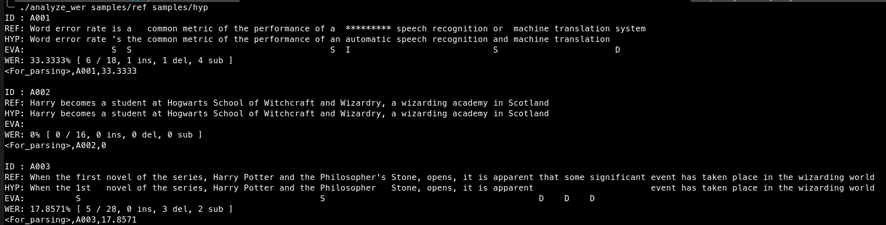

# WER-in-cpp

- Based on [WER-in-python](https://github.com/zszyellow/WER-in-python) and kaldi's [compute-wer.cc](https://github.com/kaldi-asr/kaldi/blob/master/src/bin/compute-wer.cc) implementation of computing word-error-rate (WER) using edit distance dynamic programming. I port the algorithm into C++ with new features:
    + Support multi-line reference and hypothesis
    + Improve the runtime and feasibility when aligning long sentences

#### Usage

```bash
chmod +x compute-wer
./compute-wer [Reference] [Hypothesis]
```

#### Examples
- Reference `samples/ref`
- Hypothesis `samples/hyp`
- Result: `./compute-wer samples/ref samples/hyp`


